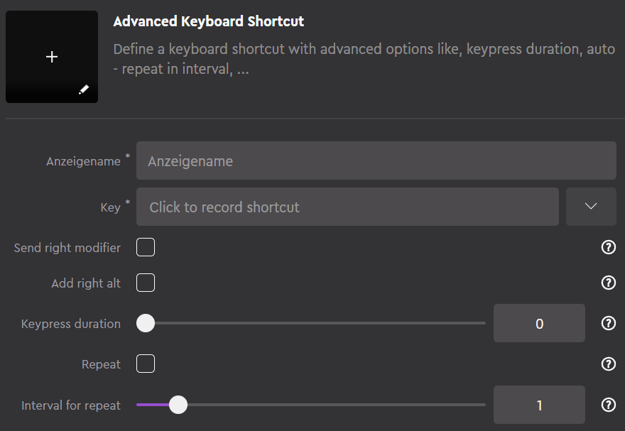
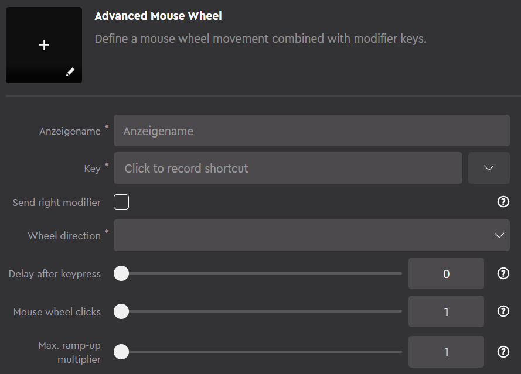

# Advanced Commands Plugin for Loupedeck
This plugin allows you to create two types of advanced commands for Loupedeck:
- **Advanced Keyboard Shortcut**
- **Advanced Mouse Wheel**

The advanced options include sending right modifiers (RIGHT CTRL, RIGHT ALT,...), simulating long key presses and more.

The key combinations are sent via InputSimulatorPlus (https://github.com/TChatzigiannakis/InputSimulatorPlus) instead of via the Loupedeck API's.

## Advanced Keyboard Shortcut
This command allows you to create a keyboard shortcut with more options than is possible with the built-in keyboard shortcuts.

Explanation of parameters:
- **Key**: The actual key combination is entered here.
- **Send right modifier**: If the key combination contains one of the modifiers CTRL, ALT, SHIFT, WINDOWS and this option is set, then the right key is sent instead of LEFT CTRL, LEFT ALT, LEFT SHIFT, LEFT WINDOWS , i.e. RIGHT CTRL, RIGHT ALT, RIGHT SHIFT...
- **Add right alt**: Appends the modifier `RIGHT ALT` to the key combination defined in `Key`. Use this option if your keyboard has a right ALT GR key instead of just ALT and you are having trouble sending the right Alt key with the `Send right modifier` option. In this case, you leave out the modifier completely in the `Key` parameter. Example: The key combination `RIGHT ALT + N` should be sent. To do this, only **N** is entered in the `Key` parameter and the `Add right alt` option is also activated.
- **Keypress duration**: In some applications you often have to hold down keys for a longer period of time (long press). This can be simulated with this option. If the value is 0, a normal keypress is used; if the value is greater than 0, the key is held down for the specified period of time in milliseconds. A good starting value for a long press is 500 ms.
- **Repeat**: This option can be used to specify that the specified key is pressed repeatedly at an interval. If the command is triggered for the first time, a timer is started that presses the same button again and again at the defined interval until the command is triggered a second time. It is best to combine these commands with multi-toggle actions.
- **Repeat Interval**: Only relevant in conjunction with `Repeat`. Specifies the interval at which the key should be pressed.

## Advanced Mouse Wheel
This command allows you to create a combination of mouse wheel + keyshortcut command with more options than is possible with the built-in mouse wheel command.

